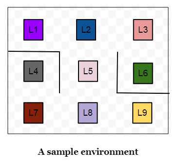
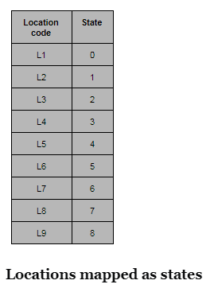
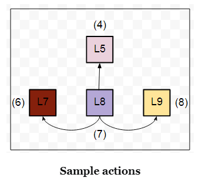
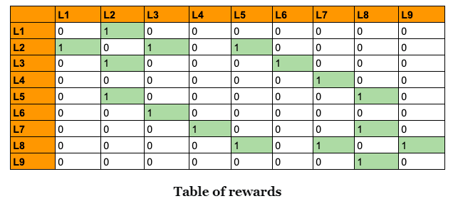

# Q-Learning : Guitar Building Factory
Build a few autonomous robots for a guitar building factory

<br/>

### Usage - Running Jupyter notebook

**Running in a local installation**

Launch with:

```
$ jupyter notebook
```

<br/>

<br/>

## Defining the problem statement

We are to build a few autonomous robots for a guitar building factory.

These robots will help the guitar luthiers by conveying them the necessary guitar parts that they would need in order to craft a guitar.

These different parts are located at **nine** different positions within the factory warehouse.

Guitars parts include polished wood stick for the fretboard, polished wood for the guitar body, guitar pickups and so on.

The luthiers have prioritized the location that contains body woods to be the topmost.

They have provided the priorities for other locations as well which we will look in a moment.

These locations within the factory warehouse look like



As we can see there are little obstacles present (represented with smoothed lines) in between the locations. 

**L6** is the top-priority location that contains the polished wood for preparing guitar bodies.

Now, the task is to *enable the robots so that they can find the shortest route from any given location to another location on their own*.

The **agents**, in this case, are the robots.

The **environment** is the guitar factory warehouse.

<br/>

## The states

The states are the locations.

The location in which a particular robot is present in the particular instance of time will denote its state.

Machines understand numbers rather than letters.

So, let’s map the location codes to numbers.



<br/>

## The actions

In our example, the actions will be *the direct locations* that a robot can go to from a particular location.

Consider, a robot is at the **L8** location and the direct locations to which it can move are **L5**, **L7** and **L9**.

The below figure may come in handy in order to visualize this.



As you might have already guessed the set of actions here is nothing but the set of all possible states of the robot.

For each location, the set of actions that a robot can take will be different.

For example, the set of actions will change if the robot is in L1.

<br/>

## The rewards

By now, we have the following two sets:

- A set of states:
  - S=0,1,2,3,4,5,6,7,8
- A set of actions:
  - A=0,1,2,3,4,5,6,7,8

The rewards, now, will be given to a robot if a location (read it *state*) is *directly* reachable from a particular location.

<br/>

L9 is directly reachable from L8.

So, if a robot goes from L8 to L9 and vice-versa, it will be rewarded by 1.

If a location is not directly reachable from a particular location, we do not give any reward (a reward of **0**).

Yes, the reward is just a number here and nothing else.

It enables the robots to make sense of their movements helping them in deciding what locations are directly reachable and what are not.

With this cue, we can construct a reward table which contains all the reward values mapping between all the possible states (locations).



In the above table, we have all the possible rewards that a robot can get by moving in between the different states.

<br/>

<br/>

###### Ref. https://blog.floydhub.com/an-introduction-to-q-learning-reinforcement-learning/

**[Accessed Dec 21, 2021]**